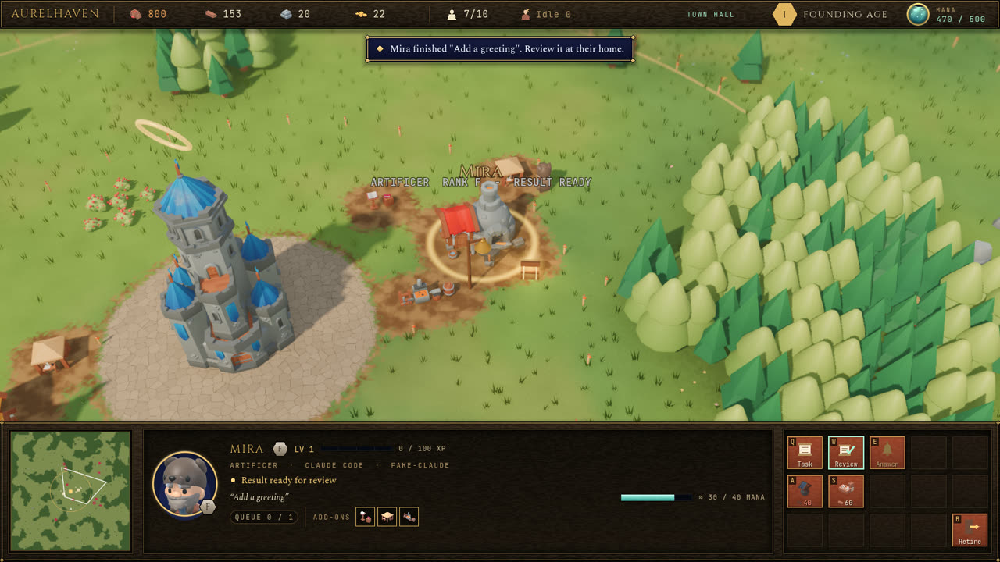
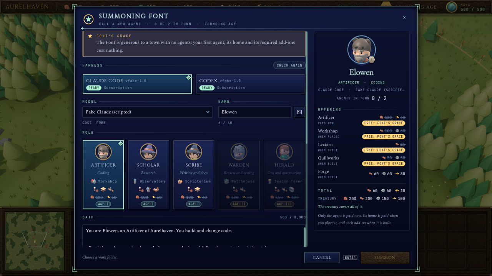
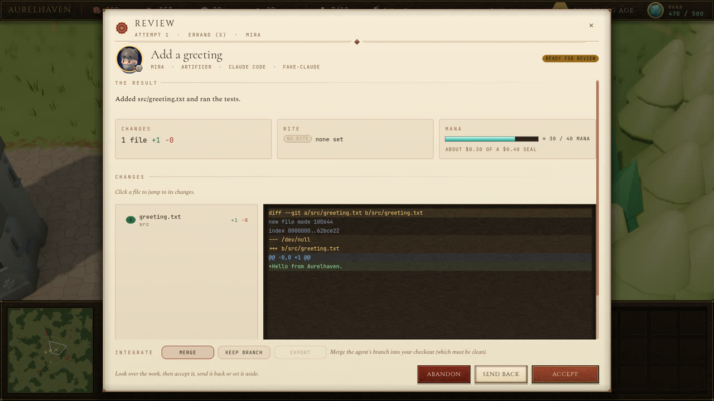

# Aurelhaven

Aurelhaven is a town-building game in the style of Age of Empires, set in an isekai fantasy
world, in which the work is real. Every agent you summon is a real AI coding agent (Claude Code,
Codex, or any other model through pi) working on your own projects.

- **Agents are villagers.** You summon them at the Keep the way Age of Empires trains villagers:
  a queue, a progress bar and a full options dialog (harness, model, role, oath, work folder,
  approval mode, budget seals, starting tools).
- **Agents build their own homes.** Each agent walks out, builds a home for its role, then builds
  small add-on buildings, and each add-on is a real capability. A Lectern lets it read files, a
  Quillworks lets it write them and a Forge lets it run commands. A Rookery adds web access, an
  Archive adds instructions and skills, and a Waygate adds an MCP server.
- **Townsfolk keep the town running.** Your human townsfolk gather food and wood, build cottages,
  and carry task scrolls from the Keep to the agents' homes. A task starts when its scroll
  arrives.
- **You stay in control.** When an agent needs permission, a bell rings at its home. When it
  finishes, you review the diff and accept, send back or abandon the work. Accepted work pays the
  town in resources and the agent in experience.
- **Real money is separate.** Mana is your real budget (1 Mana = $0.01) with a hard cap; it can
  never be earned or bought in the game.

Aurelhaven is a game about directing real work, not a visualisation of your code.



| Summoning an agent | Reviewing its work |
|---|---|
|  |  |

## Status

| Phase | Scope | State |
|---|---|---|
| 0 | Tools and spikes: harnesses, git worktrees on Windows, the web token handoff | Done |
| 1 | Town Hall core: database, protocol, tasks, approvals, Mana, ledger and rewards, with a scripted stand-in agent | Done |
| 2 | The offline town: map, camera, units, gathering, construction, HUD | Done |
| 3 | Agents as villagers: summoning, homes and add-ons, couriers, approvals, review and rewards | Done |
| 4 | Real harnesses: the Claude Code CLI, the Codex CLI (`codex app-server`) and pi | Done |
| 5 | Progression and polish: ages and walls, onboarding, menus, audio | In progress |

Tested on Windows 11, desktop and web (the web build is served by the Town Hall). macOS and
Linux builds are exported but untested.

## How it fits together

```
Godot client (desktop or web) <-- WebSocket on 127.0.0.1 --> Town Hall (TypeScript, Node 22)
  the town: map, units, gathering,                             agents, tasks, approvals, parties,
  construction, HUD                                            Mana, resource ledger, ages, saves
                                                               |
                                    Claude Code CLI, Codex CLI (app-server), pi (RPC mode)
                                                               |
                                              git worktrees in your work folders
```

The **Town Hall** (`townhall/`) is a small local service that owns everything real: agents,
tasks, approvals, Mana, the resource ledger and saved towns. It runs each agent on an existing
harness as a child process and routes every permission request to the player. The **client**
(`client/`) is the Godot game; it simulates the town and mirrors the Town Hall's state. See
[docs/architecture.md](docs/architecture.md).

## Requirements

- Windows 10 or 11.
- [Node.js](https://nodejs.org) 22.12 or newer, and git.
- Godot 4.7.2 (standard build) with its export templates, in `.tools/godot/`. Only needed to
  build the game or run it from source; see [docs/development.md](docs/development.md#tools).
- For real agents, at least one harness installed and signed in: the
  [Claude Code CLI](https://docs.claude.com/en/docs/claude-code) or the Codex CLI. pi is bundled
  with the Town Hall and needs a model provider sign-in of its own.

## Getting started

From a fresh clone (PowerShell):

```powershell
cd townhall
npm ci
cd ..
node scripts/build-game.mjs --windows-only
.\client\export\windows\Aurelhaven.exe
```

The game finds a running Town Hall or starts one itself (from `townhall/`, detached, logging to
`townhall/data/townhall.log`). The Town Hall keeps running after you close the game, so agents
can finish their work while you are away.

To run from source instead, open `client/project.godot` in Godot 4.7.2 and press Play, or run
`.tools\godot\Godot_v4.7.2-stable_win64.exe --path client`. Add `-- --offline` to play a town
without the Town Hall.

### Practice agents and real agents

A Town Hall the game starts runs **practice agents**: a scripted stand-in that plays through
tasks, approvals and reviews without running anything or spending Mana. The in-game choice
between practice and real agents arrives with Phase 5. Until then, run the Town Hall yourself
with real agents:

1. Close the game and stop any Town Hall it started (the `node.exe` process running
   `townhall\src\main.ts`; Task Manager, Details tab, shows the command line).
2. Start it with real agents and leave the window open:
   ```powershell
   cd townhall
   $env:AURELHAVEN_PROVIDER = "real"
   npm start
   ```
3. Open the game; it connects to that Town Hall. Press Ctrl+C in the window to stop it.

Real agents use your own Claude Code, Codex or pi sign-in. Every task has a Mana seal (a cost
cap), the Mana pool caps each day (or week, or month), and an agent can only use the tools its
add-ons grant.

### Web

`node scripts/build-game.mjs --web-only` exports the web build to `client/export/web/`. The Town
Hall serves it: open the `Web client:` address it prints (also the `url` in
`townhall/data/runtime.json`). The address carries the session token in its `#t=` fragment; the
page moves it out of the address bar.

## Controls

| Input | Action |
|---|---|
| Left click, drag | Select, box-select (Shift adds) |
| Double-click | Select everything of that type on screen |
| Right click | Move, gather, build, carry a scroll to an agent's home, set a rally point |
| Q W E R T, A S D F G, Z X C V B | The 5 x 3 command card |
| Ctrl+1 to 9, then 1 to 9 | Assign and recall control groups (double tap to centre the camera) |
| . (period) | Next idle townsperson |
| H | Select the Keep |
| Space | Jump to the oldest ringing bell (an approval waiting) |
| F4 | Mana budget |
| Delete | Cancel the selected construction site or the last unit in training |
| Arrow keys, screen edge, middle-drag | Pan |
| Mouse wheel | Zoom toward the cursor |
| Ctrl+Left / Right, Alt+middle-drag | Rotate |
| F2, F3 | Toggle night, show FPS |
| F5, F9 | Save, load an offline town (online towns save to the Town Hall) |
| Pause | Pause |
| Esc | Cancel or close the top window |

## Safety

- **Your checkout is left alone until you accept.** In a git repository each task gets its own
  worktree on a branch `aurelhaven/<agent>/<task>`. Accepting merges it only when your checkout
  is clean and on the target branch; otherwise the branch is kept for you. A folder that is not a
  repository is worked on in a versioned copy. Accepting writes the changed files back all at
  once, or not at all if you edited one of them in the meantime.
- **No destructive git.** The Town Hall never runs `reset --hard`, `clean`, `stash` or a forced
  worktree removal; a test enforces it.
- **Tools come from add-ons.** An agent gets only the tools its add-ons grant. Anything outside
  the trusted rules of its approval mode waits for your answer.
- **Local only.** The Town Hall listens on 127.0.0.1, makes a new token at every start, checks
  the Host and Origin headers, and never stores provider credentials.

## Repository layout

| Path | Contents |
|---|---|
| `client/` | The Godot 4.7.2 project (GDScript): simulation, world, HUD, networking, tests |
| `townhall/` | The Town Hall service (TypeScript, Node 22); see [townhall/README.md](townhall/README.md) |
| `protocol/` | The client and Town Hall contract: `PROTOCOL.md`, `economy.json` (every game constant), `pricing.json`, generated GDScript |
| `scripts/` | Build, sync, end-to-end check and asset scripts |
| `art_src/` | The Blender pipeline that builds models, characters and icons from the KayKit kits |
| `docs/` | Architecture, development guide, spike notes, README images |
| `design_handoff_aurelhaven/` | The original design handoff: lore, colours, fonts, the wall animation |
| `.tools/` (ignored) | Godot, export templates, vendored art sources |
| `out/` (ignored) | Screenshots and reports written by tools |

## Documentation

- [docs/architecture.md](docs/architecture.md): how the Town Hall and the client work and talk.
- [docs/development.md](docs/development.md): tools, tests, builds, conventions and
  troubleshooting.
- [townhall/README.md](townhall/README.md): running and configuring the Town Hall.
- [protocol/PROTOCOL.md](protocol/PROTOCOL.md): the WebSocket protocol.
- [docs/spikes.md](docs/spikes.md): findings from the harness, worktree and web experiments.
- [CREDITS.md](CREDITS.md): art, fonts and software.
